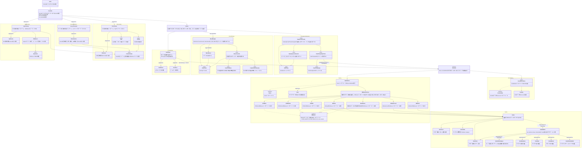

```mermaid
classDiagram

class index {
	Controllerのインスタンス化init処理
}
index --> Controller


class Controller {
	Serviceのインスタンス化、デバイスへのconnect処理
	Device Controllerの実行
	API Controllerの実行
	CLI Controllerの実行
}
Controller --> Service
Controller --> DeviceController : [arg] Service
Controller --> ApiController : [arg] Service
Controller --> CliController : [arg] Service


namespace DeviceController_ {
	class DeviceController {
		デバイスの具体処理をインポートし、onメソッドへオーバーライドする
	}
	
	class DeviceService {
		Deviceの具体処理（ボタン動作、LED制御）をServiceを元に実装
	}
}
%% DeviceController --> Service : type
%% DeviceController --> Device : type
DeviceController --> DeviceService : [arg] Service

%% DeviceService --> Service : type
%% DeviceService --> Device : type
DeviceService --> CliService
DeviceService --> FaceletsDrawer


namespace ApiController_ {
	class ApiController {
		APIの具体処理をインポートし、WebServerにルーティングする
	}
	
	class ApiService {
		APIの具体処理をServiceを元に実装
	}
	
	class WebServer {
		Expressサーバーの実行、ルーティング登録メソッドの実装
	}
	
	class RpsLimiter {
		<<static>>
		WebServerへのRPS制限
	}
}
%% ApiController --> Service : type
ApiController --> ApiService : [arg] Service
ApiController --> FaceletsDrawer
ApiController --> WebServer

%% ApiService --> Service : type

WebServer --> RpsLimiter


namespace CliController_ {
	class CliController {
		CLIの具体処理をインポートし、Replへルーティングする
	}
	
	class CliService {
		CLIの具体処理をServiceを元に実装
	}
	
	class CliView {
		<<static>>
		CLIの出力方法定義
	}
	
	class FaceletsDrawer {
		<<static>>
		Faceletsをコンソール上で展開図表示するdrawメソッドを実装
	}
	
	class Repl {
		<<static>>
		replの実行、コマンド登録メソッドの実装
	}
}
%% CliController --> Service : type
CliController --> CliService : [arg] Service
CliController --> CliView
CliController --> Repl

CliView --> FaceletsDrawer


class Service {
	各種ビジネスロジックClassをとりまとめてインスタンス化し、API、CLI提供用メソッドを実装
}
%% Service --> Device : type
Service --> CubeRobot
Service --> MoveManager : [arg] CubeRobot
Service --> SequenceGenerator


namespace CubeRobot_ {
	class CubeRobot {
		ロボット制御操作実装クラス
		D/D'/x/y/y'のCubeの回転を実装
	}
	
	class StandServo {
		スタンドサーボの制御
	}
	
	class ArmServo {
		アームサーボの制御
	}
}
CubeRobot --> StandServo : [arg] Device
CubeRobot --> ArmServo : [arg] Device
%% CubeRobot --> Device : type
CubeRobot --> Factories : deviceFactory() => Device

%% StandServo --> Device : type

%% ArmServo --> Device : type


namespace MoveManager_ {
	class MoveManager {
		MoveParser, MoveConverter, MoveRunnerをとりまとめ、統合したメソッドを提供するクラス
	}
	
	class MoveParser {
		<<static>>
		Moveをパースする
	}
	
	class MoveRunner {
		シーケンスを実行する
	}
	
	class MoveConverter {
		<<static>>
		回転記号をスクランブラーの動作に変換する
	}
	
	class FaceOrientation {
		<<static>>
		X/Y/Z回転時のCubeの向きの更新状態を取得する
	}
	
	class CubeRotationSimulator {
		<<static>>
		Move時のCubeの回転状態をシミュレートする
	}
}
%% MoveManager --> CubeRobot : type
MoveManager --> MoveRunner : [arg] CubeRobot
MoveManager --> MoveConverter
MoveManager --> MoveParser

%% MoveRunner --> CubeRobot : type
MoveRunner --> MoveParser

MoveConverter --> MoveParser
MoveConverter --> FaceOrientation
MoveConverter --> CubeRotationSimulator


namespace SequenceGenerator_ {
	class SequenceGenerator {
		<<static>>
		min2phaseおよびCubeChampleAPIを使用しスクランブル、ソルブを生成するクラス
	}
	
	class Min2Phase{
		<<static>>
		min2phaseラッパークラス
	}
	
	class CubeChampleApiCache{
		<<static>>
		CubeChampleAPIのキャッシュ管理クラス
	}
	
	class CubeChampleApi {
		<<static>>
		CubeChampleAPIのラッパークラス
	}
	
	class StepSequenceGenerator {
		<<static>>
		ステップごとのパターンをランダム生成するクラス
	}
}
SequenceGenerator --> Min2Phase
SequenceGenerator --> CubeChampleApiCache
SequenceGenerator --> StepSequenceGenerator

CubeChampleApiCache --> CubeChampleApi
%% CubeChampleApiCache --> ScrambleDao : type
CubeChampleApiCache --> Factories : scrambleDaoFactory() => ScrambleDao

StepSequenceGenerator --> Min2Phase


class Factories {
	<<function>>
	Device, ScrambleDaoそれぞれのインスタンスのファクトリー関数を提供
}
%% Factories --> Device : type
Factories --> OpnizDevice
%% Factories --> ScrambleDao : type
Factories --> ScrambleJsonDao


namespace Device_ {
	class Device {
		<<interface>>
		Deviceインターフェース
	}
	
	class OpnizDevice {
		DeviceインターフェースのOpniz.M5Unified実装
	}
	
	class Servo {
		サーボモーターの角度->PWM変換を実装
	}
	
	class M5DeviceFactory {
		接続中のデバイス情報を取得し、M5Deviceインタフェース実装クラスに該当するものがあればインスタンスを返す
	}
	
	class M5Device {
		<<interface>>
		M5Stackデバイスごとの個別実装インターフェース
		（STAND_SERVO_PIN, ARM_SERVO_PIN, onrun, onstop）
	}
	
	class ATOMLite {
		ATOMLiteのM5Deviceインターフェース実装
	}
	
	class ATOMS3 {
		ATOMS3のM5Deviceインターフェース実装
	}
	
	class ATOMS3Lite {
		ATOMS3LiteのM5Deviceインターフェース実装
	}
	
	class M5Stack {
		M5StackのM5Deviceインターフェース実装
	}
	
	class M5StackCore2 {
		M5StackCore2のM5Deviceインターフェース実装
	}
	
	class M5StickC {
		M5StickCのM5Deviceインターフェース実装
	}
	
	class BlankDevice {
		対応済みデバイス以外を使用時に指定するM5Deviceインターフェース実装
	}
}
OpnizDevice ..|> Device
OpnizDevice --> Servo : [arg] Device
OpnizDevice --> M5DeviceFactory

%% Servo --> Device : type

M5DeviceFactory --> ATOMLite
M5DeviceFactory --> ATOMS3
M5DeviceFactory --> ATOMS3Lite
M5DeviceFactory --> M5Stack
M5DeviceFactory --> M5StackCore2
M5DeviceFactory --> M5StickC
M5DeviceFactory --> BlankDevice

ATOMLite ..|> M5Device
ATOMS3 ..|> M5Device
ATOMS3Lite ..|> M5Device
M5Stack ..|> M5Device
M5StackCore2 ..|> M5Device
M5StickC ..|> M5Device
BlankDevice ..|> M5Device

ATOMS3 --> Avatar
M5Stack --> Avatar
M5StackCore2 --> Avatar
M5StickC --> Avatar


namespace Avatar_ {
	class Avatar {
		画面付きM5Stackデバイスでアバター表示する
	}
	
	
	
	class AvatarCore {
		アバター関連コアAPI、定数を実装
	}
	
	class AvatarState {
		アバターの状態管理（initialized, stopping）
	}
	
	class AvatarFace {
		アバター表情のパターン実装
	}
	
	class AvatarMotion {
		Eye, Eyebrow, Mouse, EmotionMarkとsleepを組み合わせたモーション実装
	}
	
	
	
	class AvatarMotionQueue {
		キューに登録されたモーションを指定間隔で直列実行する
	}
	
	
	
	class AvatarEyebrow {
		アバターの眉毛の描画
	}
	
	class AvatarEye {
		アバターの目の描画
	}
	
	class AvatarMouse {
		アバターの口の描画
	}
	
	class AvatarEmotionMark {
		アバターのエモーションマークの描画
	}
}
Avatar --> AvatarCore
Avatar --> AvatarState
Avatar --> AvatarMotion: [arg] AvatarCore, AvatarState
Avatar --> AvatarFace

AvatarMotion --> AvatarMotionQueue: [arg] AvatarCore, AvatarState
AvatarMotion --> AvatarEyebrow: [arg] AvatarCore
AvatarMotion --> AvatarEye: [arg] AvatarCore
AvatarMotion --> AvatarMouse: [arg] AvatarCore
AvatarMotion --> AvatarEmotionMark: [arg] AvatarCore
AvatarMotion --> AvatarFace


namespace ScrambleDao_ {
	class ScrambleDao {
		<<interface>>
		Scrambleデータのload, saveインターフェース
	}
	
	class ScrambleJsonDao {
		<<static>>
		ScrambleDaoインターフェースのJSON実装
	}
	
	class JsonDao {
		JSONデータのload, saveを実装
	}
}
ScrambleJsonDao --> JsonDao
ScrambleJsonDao ..|> ScrambleDao

```
