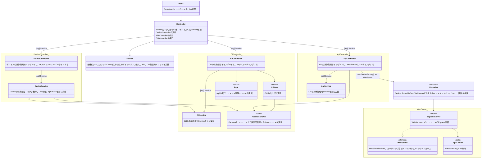

```mermaid
classDiagram

class index {
	Controllerのインスタンス化、init処理
}
index --> Controller


class Controller {
	Serviceのインスタンス化、デバイスへのconnect処理
	Device Controllerの実行
	API Controllerの実行
	CLI Controllerの実行
}
Controller --> Service
Controller --> DeviceController : [arg] Service
Controller --> ApiController : [arg] Service
Controller --> CliController : [arg] Service


namespace DeviceController_ {
	class DeviceController {
		デバイスの具体処理をインポートし、onメソッドへオーバーライドする
	}
	
	class DeviceService {
		Deviceの具体処理（ボタン動作、LED制御）をServiceを元に実装
	}
}
%% DeviceController --> Service : type
%% DeviceController --> Device : type
DeviceController --> DeviceService : [arg] Service

%% DeviceService --> Service : type
%% DeviceService --> Device : type
DeviceService --> CliService
DeviceService --> FaceletsDrawer


namespace ApiController_ {
	class ApiController {
		APIの具体処理をインポートし、WebServerにルーティングする
	}
	
	class ApiService {
		APIの具体処理をServiceを元に実装
	}
}
%% ApiController --> Service : type
ApiController --> ApiService : [arg] Service
ApiController --> FaceletsDrawer
ApiController --> Factories : webServerFactory() => WebServer

%% ApiService --> Service : type


namespace CliController_ {
	class CliController {
		CLIの具体処理をインポートし、Replへルーティングする
	}
	
	class CliService {
		CLIの具体処理をServiceを元に実装
	}
	
	class CliView {
		<<static>>
		CLIの出力方法定義
	}
	
	class FaceletsDrawer {
		<<static>>
		Faceletsをコンソール上で展開図表示するdrawメソッドを実装
	}
	
	class Repl {
		<<static>>
		replの実行、コマンド登録メソッドの実装
	}
}
%% CliController --> Service : type
CliController --> CliService : [arg] Service
CliController --> CliView
CliController --> Repl

CliView --> FaceletsDrawer


class Service {
	各種ビジネスロジックClassをとりまとめてインスタンス化し、API、CLI提供用メソッドを実装
}


class Factories {
	<<function>>
	Device, ScrambleDao, WebServerそれぞれのインスタンスのファクトリー関数を提供
}
%% Factories --> WebServer : type
Factories --> ExpressServer


namespace WebServer_ {
	class WebServer {
		<<interface>>
		Webサーバーlisten、ルーティング登録メソッドをもつインターフェース
	}
	
	class ExpressServer {
		<<static>>
		WebServerインターフェースのExpress実装
	}
	
	class RpsLimiter {
		<<static>>
		WebServerへのRPS制限
	}
}
ExpressServer ..|> WebServer
ExpressServer --> RpsLimiter

```
