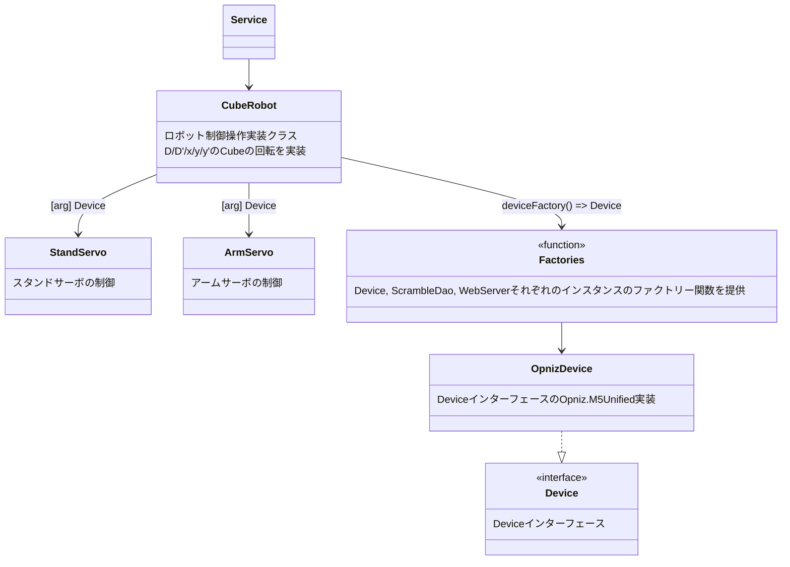

```mermaid
classDiagram

class Service {
	
}
Service --> CubeRobot


class CubeRobot {
	ロボット制御操作実装クラス
	D/D'/x/y/y'のCubeの回転を実装
}
CubeRobot --> StandServo : [arg] Device
CubeRobot --> ArmServo : [arg] Device
%% CubeRobot --> Device : type
CubeRobot --> Factories : deviceFactory() => Device

class StandServo {
	スタンドサーボの制御
}
%% StandServo --> Device : type

class ArmServo {
	アームサーボの制御
}
%% ArmServo --> Device : type


class Factories {
	<<function>>
	Device, ScrambleDao, WebServerそれぞれのインスタンスのファクトリー関数を提供
}
%% Factories --> Device : type
Factories --> OpnizDevice


class Device {
	<<interface>>
	Deviceインターフェース
}

class OpnizDevice {
	DeviceインターフェースのOpniz.M5Unified実装
}
OpnizDevice ..|> Device

```
