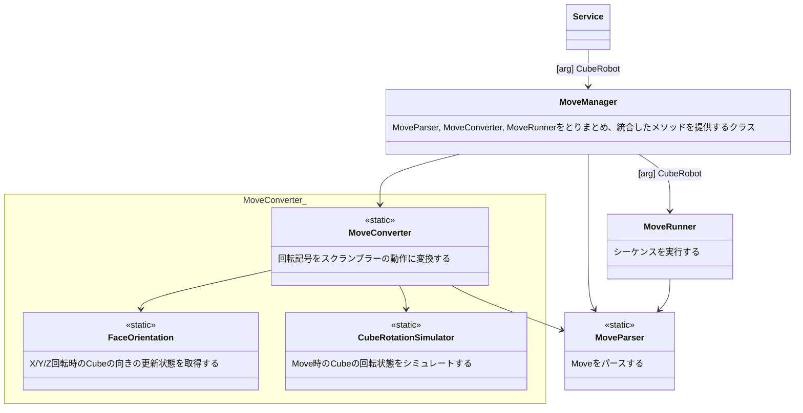

```mermaid
classDiagram

class Service {
	
}
Service --> MoveManager : [arg] CubeRobot


class MoveManager {
	MoveParser, MoveConverter, MoveRunnerをとりまとめ、統合したメソッドを提供するクラス
}
%% MoveManager --> CubeRobot : type
MoveManager --> MoveRunner : [arg] CubeRobot
MoveManager --> MoveConverter
MoveManager --> MoveParser

class MoveParser {
	<<static>>
	Moveをパースする
}

class MoveRunner {
	シーケンスを実行する
}
%% MoveRunner --> CubeRobot : type
MoveRunner --> MoveParser

namespace MoveConverter_ {
	class MoveConverter {
		<<static>>
		回転記号をスクランブラーの動作に変換する
	}
	
	class FaceOrientation {
		<<static>>
		X/Y/Z回転時のCubeの向きの更新状態を取得する
	}
	
	class CubeRotationSimulator {
		<<static>>
		Move時のCubeの回転状態をシミュレートする
	}
}
MoveConverter --> MoveParser
MoveConverter --> FaceOrientation
MoveConverter --> CubeRotationSimulator

```
