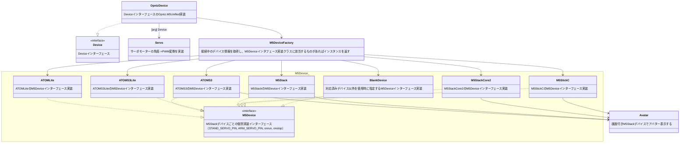

```mermaid
classDiagram

class Device {
	<<interface>>
	Deviceインターフェース
}

class OpnizDevice {
	DeviceインターフェースのOpniz.M5Unified実装
}
OpnizDevice ..|> Device
OpnizDevice --> Servo : [arg] Device
OpnizDevice --> M5DeviceFactory


class Servo {
	サーボモーターの角度->PWM変換を実装
}
%% Servo --> Device : type


class M5DeviceFactory {
	接続中のデバイス情報を取得し、M5Deviceインタフェース実装クラスに該当するものがあればインスタンスを返す
}
M5DeviceFactory --> ATOMLite
M5DeviceFactory --> ATOMS3
M5DeviceFactory --> ATOMS3Lite
M5DeviceFactory --> M5Stack
M5DeviceFactory --> M5StackCore2
M5DeviceFactory --> M5StickC
M5DeviceFactory --> BlankDevice


namespace M5Device_ {
	class M5Device {
		<<interface>>
		M5Stackデバイスごとの個別実装インターフェース
		（STAND_SERVO_PIN, ARM_SERVO_PIN, onrun, onstop）
	}
	
	class ATOMLite {
		ATOMLiteのM5Deviceインターフェース実装
	}
	
	class ATOMS3 {
		ATOMS3のM5Deviceインターフェース実装
	}
	
	class ATOMS3Lite {
		ATOMS3LiteのM5Deviceインターフェース実装
	}
	
	class M5Stack {
		M5StackのM5Deviceインターフェース実装
	}
	
	class M5StackCore2 {
		M5StackCore2のM5Deviceインターフェース実装
	}
	
	class M5StickC {
		M5StickCのM5Deviceインターフェース実装
	}
	
	class BlankDevice {
		対応済みデバイス以外を使用時に指定するM5Deviceインターフェース実装
	}
}
ATOMLite ..|> M5Device
ATOMS3 ..|> M5Device
ATOMS3Lite ..|> M5Device
M5Stack ..|> M5Device
M5StackCore2 ..|> M5Device
M5StickC ..|> M5Device
BlankDevice ..|> M5Device

ATOMS3 --> Avatar
M5Stack --> Avatar
M5StackCore2 --> Avatar
M5StickC --> Avatar


class Avatar {
	画面付きM5Stackデバイスでアバター表示する
}

```
