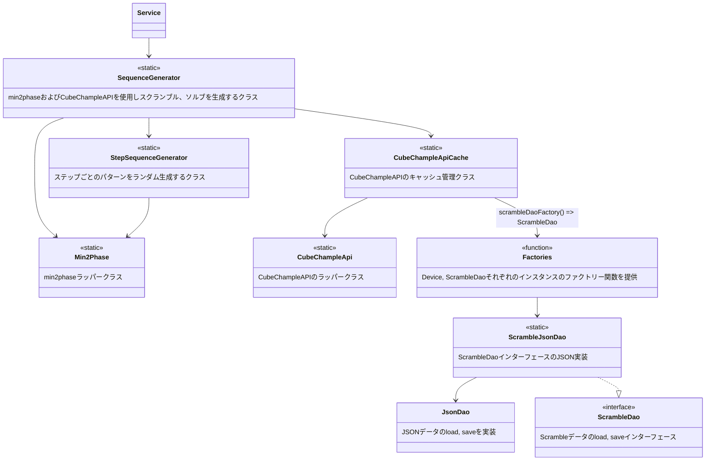

```mermaid
classDiagram

class Service {
	
}
Service --> SequenceGenerator


class SequenceGenerator {
	<<static>>
	min2phaseおよびCubeChampleAPIを使用しスクランブル、ソルブを生成するクラス
}
SequenceGenerator --> Min2Phase
SequenceGenerator --> CubeChampleApiCache
SequenceGenerator --> StepSequenceGenerator

class Min2Phase{
	<<static>>
	min2phaseラッパークラス
}

class CubeChampleApiCache{
	<<static>>
	CubeChampleAPIのキャッシュ管理クラス
}
CubeChampleApiCache --> CubeChampleApi
%% CubeChampleApiCache --> ScrambleDao : type
CubeChampleApiCache --> Factories : scrambleDaoFactory() => ScrambleDao

class CubeChampleApi {
	<<static>>
	CubeChampleAPIのラッパークラス
}


class StepSequenceGenerator {
	<<static>>
	ステップごとのパターンをランダム生成するクラス
}
StepSequenceGenerator --> Min2Phase


class Factories {
	<<function>>
	Device, ScrambleDaoそれぞれのインスタンスのファクトリー関数を提供
}
%% Factories --> ScrambleDao : type
Factories --> ScrambleJsonDao


class ScrambleDao {
	<<interface>>
	Scrambleデータのload, saveインターフェース
}

class ScrambleJsonDao {
	<<static>>
	ScrambleDaoインターフェースのJSON実装
}
ScrambleJsonDao --> JsonDao
ScrambleJsonDao ..|> ScrambleDao

class JsonDao {
	JSONデータのload, saveを実装
}

```
