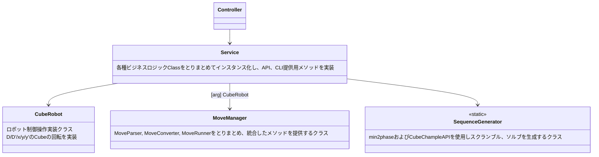

```mermaid
classDiagram

class Controller {
	
}
Controller --> Service


class Service {
	各種ビジネスロジックClassをとりまとめてインスタンス化し、API、CLI提供用メソッドを実装
}
Service --> CubeRobot
Service --> MoveManager : [arg] CubeRobot
Service --> SequenceGenerator


class CubeRobot {
	ロボット制御操作実装クラス
	D/D'/x/y/y'のCubeの回転を実装
}


class MoveManager {
	MoveParser, MoveConverter, MoveRunnerをとりまとめ、統合したメソッドを提供するクラス
}


class SequenceGenerator {
	<<static>>
	min2phaseおよびCubeChampleAPIを使用しスクランブル、ソルブを生成するクラス
}

```
