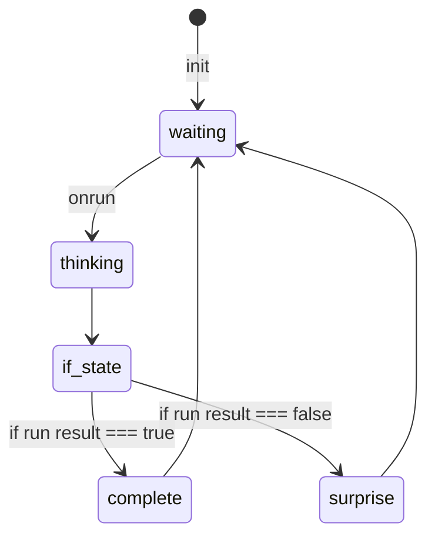

```mermaid
---
Avatar State
---
stateDiagram-v2

[*] --> waiting: init

waiting --> thinking: onrun

thinking --> if_state

if_state --> complete: if run result === true
if_state --> surprise: if run result === false

complete --> waiting
surprise --> waiting

```
